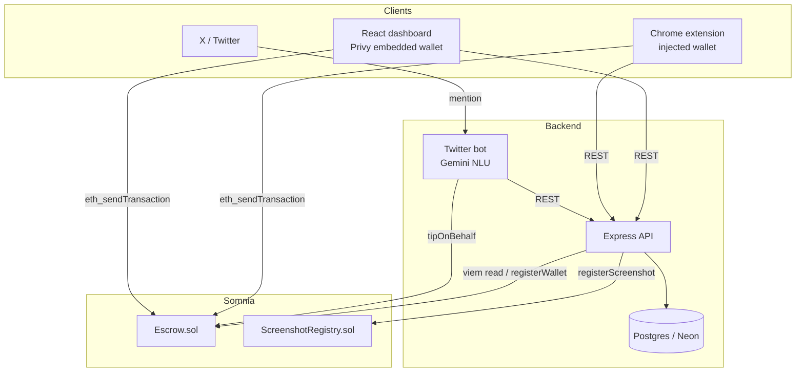
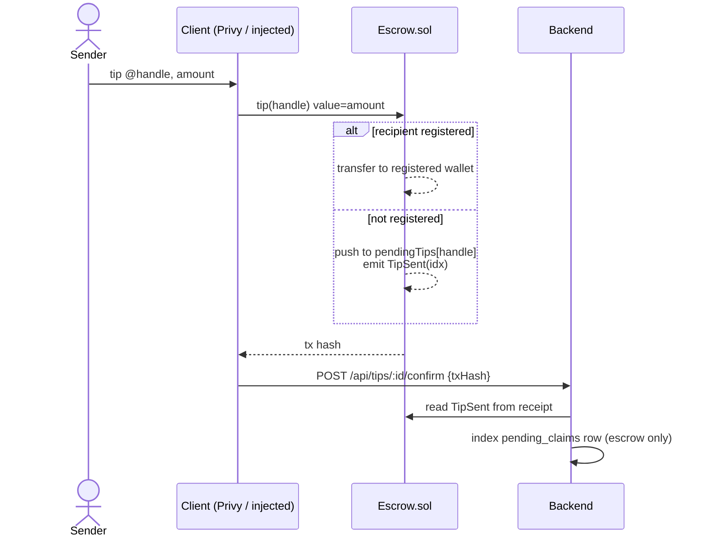
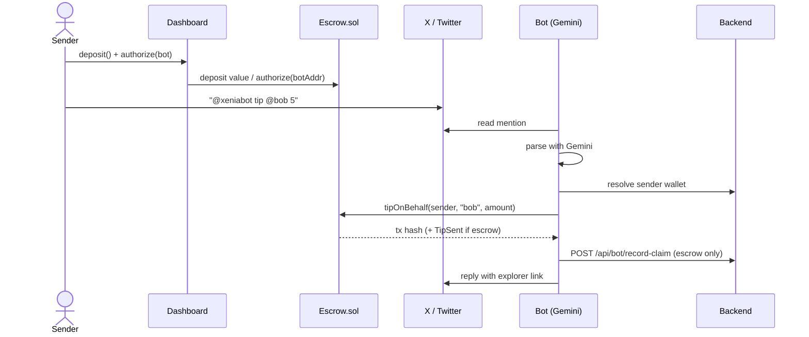
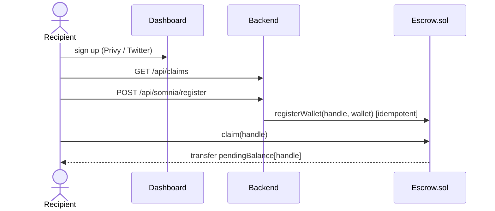

# Xenia

On-chain tipping for X (Twitter), built on Somnia Network. Tips are sent to a Twitter handle; if the recipient has no wallet yet, funds are held in an on-chain escrow keyed by their handle and released when they sign up.

## Networks

| | Testnet (Shannon) | Mainnet |
|---|---|---|
| Chain ID | `50312` | `50313` |
| Symbol | STT | SOMI |
| RPC | `https://dream-rpc.somnia.network` | `https://mainnet-rpc.somnia.network` |
| Explorer | `https://shannon-explorer.somnia.network` | `https://explorer.somnia.network` |

Deployed contracts (testnet):

| Contract | Address |
|---|---|
| `Escrow` | `0xEf0ca54F3C195737880127df62069C5B5A17B458` |
| `ScreenshotRegistry` | `0x9C3c6b9cc4ECdA73e65A240DD0cD075ce202AfE3` |

## Architecture



The user's wallet signs all value-moving calls (`tip`, `claim`, `deposit`, `authorize`). The backend wallet is the contract owner and only signs `registerWallet` and `registerScreenshot`. The bot signs `tipOnBehalf` from delegated deposits.

## Identity model

Escrow entries are keyed by the **lowercased Twitter handle** (e.g. `vitalik`), not the numeric account id, because the handle is the only identifier a sender knows at tip time for an unregistered recipient. The same key is used by `tip`, `tipOnBehalf`, `claim`, and `registerWallet`.

## Tipping modes

### Mode A — direct tip (web / extension)



### Mode B — Twitter command



### Claim



## Contracts

### `Escrow.sol`

| Function | Mode | Notes |
|---|---|---|
| `tip(handle)` payable | A | direct transfer if registered, else escrow |
| `deposit()` payable | B | credits internal balance |
| `authorize(delegate)` | B | allow delegate to call `tipOnBehalf` |
| `tipOnBehalf(sender, handle, amount)` | B | delegate-only; spends `sender`'s deposit |
| `claim(handle)` | — | registered wallet pulls all pending tips |
| `refund(handle, idx)` | — | sender refund after 90 days |
| `registerWallet(handle, wallet)` | — | `onlyOwner`, immutable once set |
| `withdrawDeposit`, `deauthorize`, `setFee`, `withdrawFees` | — | — |

Reentrancy guard on all value-moving calls. Fees tracked separately from user funds. Two-step ownership transfer.

### `ScreenshotRegistry.sol`

`registerScreenshot(cid, tweetId)` (`onlyOwner`), `verifyScreenshot(cid)`, `getProofByTweetId(tweetId)`.

## API

| Method | Path | Purpose |
|---|---|---|
| GET | `/api/config/privy` | frontend boot config |
| GET | `/api/auth/user` | session user |
| POST | `/api/tips/send` | record a tip, returns row id |
| POST | `/api/tips/:id/confirm` | attach tx hash, index escrow claim |
| GET | `/api/claims` | recipient's pending claims |
| POST | `/api/claims/:id/mark-claimed` | mark claimed after on-chain `claim` |
| GET | `/api/somnia/network` | chain, contracts, bot address |
| GET | `/api/somnia/balance/:address` | native balance |
| GET | `/api/somnia/pending/:handle` | on-chain escrow balance |
| POST | `/api/somnia/register` | idempotent `registerWallet` |
| POST | `/api/proof/register` | `registerScreenshot` |
| GET | `/api/proof/:tweetId` | proof lookup |
| GET | `/api/bot/pending-notifications` | bot: unnotified claims |
| POST | `/api/bot/record-claim` | bot: index a `tipOnBehalf` escrow tip |
| POST | `/api/bot/claims/:id/notified` | bot: mark notified |

Bot endpoints authenticate with a shared `XENIA_BOT_API_KEY` sent as `X-Extension-Key`.

## Layout

```
somnia/
├── contracts/        Hardhat — Escrow.sol, ScreenshotRegistry.sol
├── server/           Express + Drizzle; somnia.ts (viem), routes.ts, storage.ts
├── client/           React + Vite + Privy; lib/ (chains, escrow ABI, signer hook)
├── extension/        MV3; content.js, wallet_inject.js, somnia-network.js
├── bot/              Python; Gemini/Claude NLU, web3.py, tweepy
└── shared/           Drizzle schema
```

## Setup

### Contracts

```bash
cd contracts
cp .env.example .env          # PRIVATE_KEY (funded with STT)
npm install
npx hardhat run scripts/deploy.js --network somniaTestnet
```

### Backend + frontend

```bash
cp .env.example .env          # DATABASE_URL, PRIVY_*, contract addresses, BACKEND_WALLET_PRIVATE_KEY
npm install
npm run db:push
npm run dev                   # serves API + Vite client
```

### Extension

Load `extension/` unpacked. It reads the Escrow address from `/api/somnia/network` and calls `ensureSomniaChain()` before each transaction.

### Bot

```bash
cd bot
cp .env.example .env          # GEMINI_API_KEY, XENIA_BOT_API_KEY, BACKEND_WALLET_PRIVATE_KEY, TWITTER_*
pip install -r requirements.txt
python bot.py
```

Mention reading (`get_users_mentions`) requires the X API Basic tier. Mode A does not depend on the X API.

## AI provider

Tip-command parsing (Mode B) uses an LLM behind a provider-agnostic client.

| Env | Default | Notes |
|---|---|---|
| `AI_PROVIDER` | `auto` | `auto` → Gemini, then Claude, then regex |
| `GEMINI_API_KEY` | — | Google AI Studio key |
| `GEMINI_MODEL` | `gemini-2.5-flash-lite` | — |
| `ANTHROPIC_API_KEY` | — | optional fallback |
| `CLAUDE_MODEL` | `claude-haiku-4-5-20251001` | — |

If no key is set or the call fails, parsing falls back to a regex matcher.

## Deployment

Frontend → Vercel, backend → Railway, database → Neon. See [DEPLOY.md](DEPLOY.md). `npm run preflight` checks env and on-chain contract bytecode before deploy.
